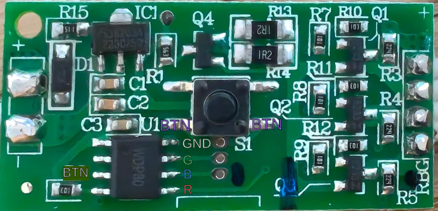
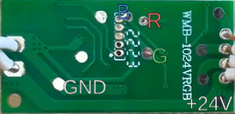
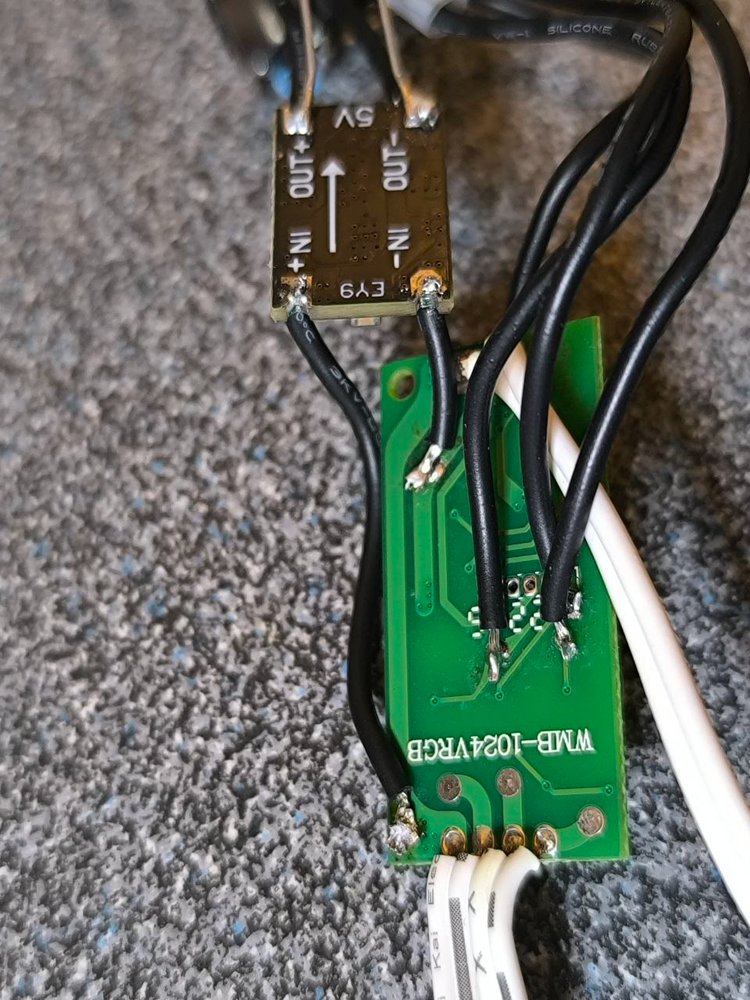

# IKEA ISKÄRNA Head Lamp - Hardware Modification Guide

This guide describes how to replace the original WDP80 chip in an IKEA ISKÄRNA head lamp with an ESP32-C3 microcontroller to add smart features and MQTT control.

## ⚠️ Safety Warning

**WARNING:** This modification involves working with 24V power supply and soldering. Ensure power is disconnected before working on the device. If you're not comfortable with electronics work, please seek assistance from someone experienced.

## 📋 Required Components

### Main Components
- **ESP32-C3 Super Mini** (tested and confirmed working)
- **24V to 5V DC-DC converter** (buck converter)
- **2kΩ resistors** × 4 (approximate value - any resistance around 1.5kΩ - 3kΩ works, **mandatory for safety**)
- Wire for connections

### Optional but Recommended
- **470µF capacitor** (for ESP32 power input - improves stability)

### Tools Needed
- Soldering iron and solder
- Wire cutters/strippers
- Multimeter (for testing)
- Small knife or file (for plastic removal)

## 🔌 Pin Connections

### ESP32-C3 Super Mini Pinout

| Function | ESP32 GPIO | Connect To |
|----------|------------|------------|
| Red LED | GPIO 1 | Red LED contact via 2kΩ resistor |
| Green LED | GPIO 4 | Green LED contact via 2kΩ resistor |
| Blue LED | GPIO 3 | Blue LED contact via 2kΩ resistor |
| Button | GPIO 5 | Button contact via 2kΩ resistor |
| GND | GND | Common ground |
| Power | 5V | 5V from DC-DC converter |

### Original IKEA Board Contacts

| Contact | Description |
|---------|-------------|
| R | Red LED positive |
| G | Green LED positive |
| B | Blue LED positive |
| Button | Button signal |
| GND | Common ground |
| +24V | 24V power input |

## 🔧 Modification Steps

### 1. Preparation
1. **Disconnect power** and remove the lamp from any power source
2. Open the lamp housing to access the PCB
3. Take photos of the original wiring for reference

### 2. Remove Original Chip
1. Locate the **WDP80 chip** on the PCB
2. Carefully desolder and remove the WDP80 chip
3. Clean the solder pads

> **Note:** The images `front_s.jpg` and `back_s.jpg` show the board with WDP80 already removed and wired.

### 3. Install DC-DC Converter
1. Connect the **24V input** from the original board to the DC-DC converter input
2. Connect **GND** from the board to the DC-DC converter ground
3. Set the DC-DC converter output to **5V** (use multimeter to verify)
4. **Optional:** Add 470µF capacitor between 5V output and GND near the ESP32

### 4. Wire the Connections

All connections from the ESP32 to the IKEA board contacts **must go through 2kΩ resistors** for safety.

#### LED Connections
```
ESP32 GPIO 1 ---[2kΩ]--- PCB Red Contact (R)
ESP32 GPIO 4 ---[2kΩ]--- PCB Green Contact (G)
ESP32 GPIO 3 ---[2kΩ]--- PCB Blue Contact (B)
```

#### Button Connection
```
ESP32 GPIO 5 ---[2kΩ]--- PCB Button Contact
```

**Optional:** Add 200nF capacitor between button contact and GND for better debouncing.

#### Power Connections
```
DC-DC 5V output ---> ESP32 5V pin
GND (common)    ---> ESP32 GND pin
```

### 5. Physical Assembly
1. **Remove plastic:** You need to remove a small amount of plastic at the bottom of the board holder to make room for the wires
2. Route wires neatly to avoid strain on solder joints
3. Secure the ESP32 and DC-DC converter in a safe location within the lamp housing
4. Ensure no bare wires can short against metal parts

### 6. Testing
1. **Before closing the housing:**
   - Double-check all connections with a multimeter
   - Verify 5V output from DC-DC converter
   - Check for shorts between power and ground
2. **Initial power-on:**
   - Connect power with the lamp still open for safety
   - Check that ESP32 boots (status LED should blink)
   - Verify WiFi connection (check your router or serial monitor)
3. **Test LEDs via MQTT:**
   ```bash
   # Test each color
   mosquitto_pub -h YOUR_BROKER -t "ikea_head_lamp/cmnd/color" -m "255,0,0"  # Red
   mosquitto_pub -h YOUR_BROKER -t "ikea_head_lamp/cmnd/color" -m "0,255,0"  # Green
   mosquitto_pub -h YOUR_BROKER -t "ikea_head_lamp/cmnd/color" -m "0,0,255"  # Blue
   ```

## 📸 Reference Images

### PCB Without WDP80 Chip (Unmodified)

#### Front Side


#### Back Side


*Connection points marked: R (Red), G (Green), B (Blue), BTN (Button), GND, and +24V*

### PCB With ESP32 Wiring (Modified)

#### Front Side - Soldered Connections


*Shows actual wiring with resistors in place and wire routing*

#### Back Side - Soldered Connections


*Shows wire routing and solder joints on the back of the board*

### Key Points to Observe

**In the unmodified PCB images (front.png, back.png):**
- Connection points are clearly marked for identification (R, G, B, Button, GND, +24V)
- Shows the original board layout before modification

**In the modified PCB images (front_s.png, back_s.png):**
- Actual resistor placement (2kΩ resistors on R, G, B lines)
- Wire routing from ESP32 to PCB contact points
- Solder joint locations and quality
- Where the WDP80 chip was originally located (now empty)

## 🔍 Component Notes

### Resistor Values
- **Specified:** 2kΩ (approximate)
- **Acceptable range:** 1.5kΩ - 3kΩ
- **Purpose:** Current limiting and safety (protects ESP32 GPIOs)
- **⚠️ DO NOT SKIP:** These resistors are **mandatory for safety**

### Capacitors
- **470µF (power):** Improves ESP32 power stability, especially during WiFi transmission

### DC-DC Converter
- Ensure it can provide at least 500mA at 5V
- Buck converter preferred (more efficient than linear regulators)
- Confirm polarity before connecting

## ⚙️ Software Configuration

After hardware modification, configure the firmware:

1. **WiFi settings:** `include/wifi_config.h`
2. **MQTT broker:** `include/mqtt_config.h`
3. **Flash firmware:** `pio run -t upload`

See main [README.md](README.md) for complete software setup instructions.

## 🎮 Button Controls

After modification, the physical button will work as follows:

| Action | Function |
|--------|----------|
| Single Click | Toggle power (on/off) |
| Long Press (~1s) | Pause/play animation |
| Double Click | Start favorite animation |

## 🐛 Troubleshooting

### ESP32 won't boot
- Check 5V power supply voltage
- Verify GND connection
- Add 470µF capacitor if not already present

### LEDs don't light up
- Verify resistors are installed
- Check LED polarity (RGB pins should be high-side switched)
- Test with MQTT commands
- Run color test: `mosquitto_pub -h BROKER -t "ikea_head_lamp/cmnd/test" -m "rgb"`

### Button doesn't work
- Check resistor connection
- Verify GPIO5 connection
- Consider adding 200nF capacitor for debouncing

### WiFi connection issues
- Check WiFi credentials in `wifi_config.h`
- Ensure 5V power supply is stable
- Move antenna away from metal parts

## 📝 Additional Notes

- This modification is **permanent** - the original WDP80 chip is removed
- Keep the original chip if you want to restore the lamp later
- Test thoroughly before final assembly
- Consider using heat shrink tubing on exposed connections
- Document your wire colors for future reference

## 🎯 Tested Configuration

This guide is based on successful testing with:
- **MCU:** ESP32-C3 Super Mini
- **Firmware:** PlatformIO ESP32 Arduino 2.0.14
- **MQTT:** Mosquitto 2.x
- **All features confirmed working:** RGB control, animations, button input, NVS storage

---

**Good luck with your modification! 🎉**

If you have questions or improvements, please contribute to the project.
